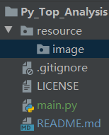

# Py_Top_Analysis
Python实现的热点舆情分析统计系统

### 简介

还没想好怎么写
后面的功能模块都是瞎写的。。。

## 功能列表

### 1.爬虫模块

- 1.定时从网络数爬取据（地址:[https://www.zhiqiang.name(https://www.zhiqiang.name)）
- 2.按城市/省份对数据进行存储并对比数据是否更新
- 3.推送更新的数据到微信机器人
- 4.推送更新的数据到钉钉机器人
- 5.推送更新的数据到TG机器人
- 6.根据用户设定的关键字/城市推送信息

### 2.微信机器人模块
#### 简介

针对指定的微信群，检测聊天记录中的新闻转发（URL或新闻标题），将该信息进行加工处理

- 0.微信的正常功能（接收和回复消息、添加好友）
- 1.接收用户订阅，包括省份/城市/关键词
- 2.接收更新的数据并转发给订阅的用户
- 3.取消订阅
- 4.消息数量限制

### 3.钉钉机器人模块

#### 简介

针对指定的钉钉群，检测聊天记录中的新闻转发（URL或新闻标题），将该信息进行加工处理

#### 功能列表

##### 微信机器人模块

- 1.订阅指定微信群
- 2.检测聊天记录，识别URL或新闻标题（正则或文本相似度匹陪）

##### 爬虫模块

两种思路，一是从网上搜集数据，自己写相似度匹配等算法，二是直接调用平台的搜索接口

##### 机器学习模块

- 图片识别，区分表情包、新闻截图等，若是新闻截图可以做ocr提取内容

## 运行环境

- 数据库：Redis

## 部分运行截图

